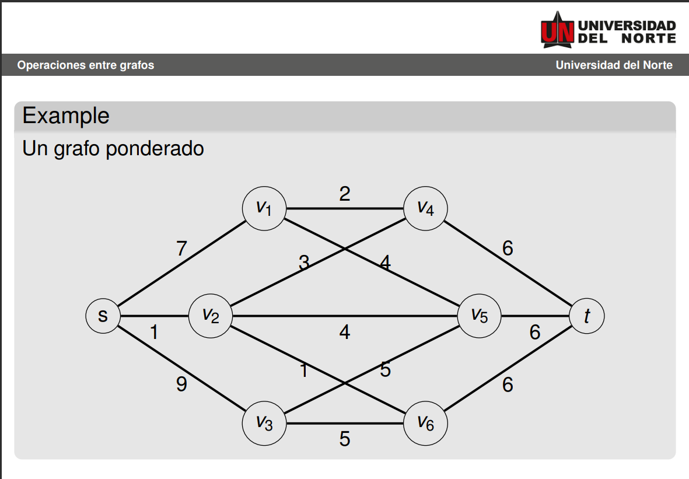

# solution



## graph

```text

s0, v2 -> 1
v2, v6 -> 1
v1, v4 -> 2
v2, v4 -> 3
v1, v5 -> 4
v2, v5 -> 4
v3, v5 -> 5
v3, v6 -> 5
v4, t7 -> 6
v5, t7 -> 6
v6, t7 -> 6
s0, v1 -> 7
s0, v3 -> 9
```

## Kruscal solution

```text
s,  v2 -> 1
v2, v6 -> 1
v1, v4 -> 2
v2, v4 -> 3
v1, v5 -> 4
v3, v5 -> 5
v4, t  -> 6
total -> 22


```
